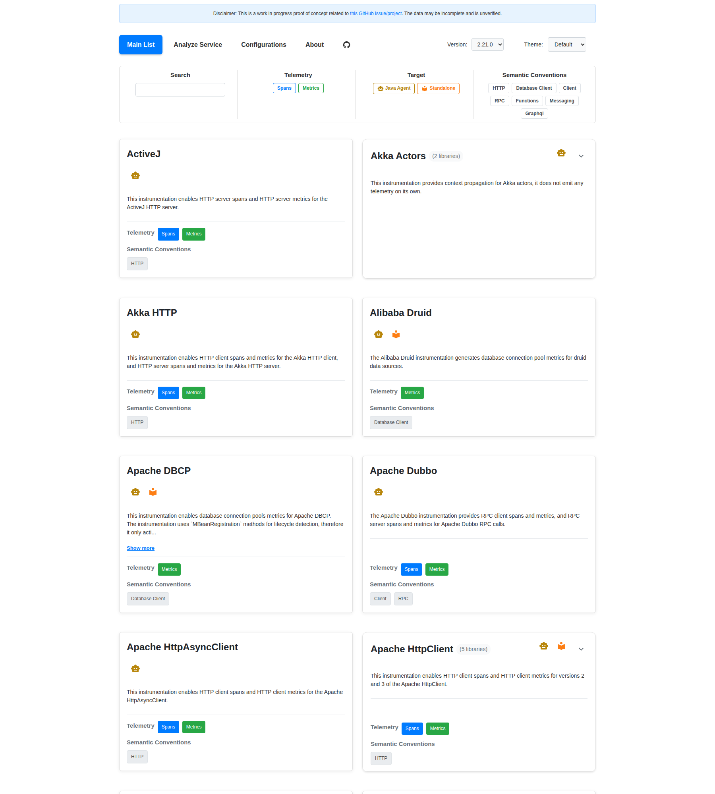

# Instrumentation Explorer

This project is a web-based tool designed to explore and display information about Java instrumentation libraries. It
provides a searchable and filterable interface for understanding the capabilities of each library, including the
telemetry data they generate (metrics and spans), their adherence to semantic conventions, and changes between different
versions.

The instrumentation data is automatically kept up to date with the latest releases from the [OpenTelemetry Java Instrumentation](https://github.com/open-telemetry/opentelemetry-java-instrumentation) repository.



## Features

*   **Library List View:** Browse a list of all instrumentation libraries.
*   **Search and Filter:** Easily find libraries by name, semantic convention, telemetry type, and target version.
*   **Library Detail View:** View comprehensive information for each library.
*   **Semantic Convention Integration:** See which metrics and attributes adhere to OpenTelemetry semantic conventions.
*   **Versioning:** Switch between different versions of the instrumentation data.
*   **Telemetry Version Diff Tool:** Compare telemetry changes (added, removed, modified metrics and spans, including attribute-level differences) between any two versions of a library.
*   **Automated Updates:** Instrumentation data is automatically updated weekly and with new releases.


## Project Structure

*   **`data-processing/`**: Contains the Python script for processing and enriching instrumentation data.
*   **`frontend/`**: Contains the React frontend application.
   *   **`frontend/public/instrumentation-list-enriched.json`**: The enriched data file used by the frontend.
*   **`scripts/`**: Contains automation scripts for updating instrumentation data.
*   **`.github/workflows/`**: GitHub Actions workflows for automated updates.
*   **`instrumentation-list-*.yaml`**: Versioned instrumentation data files from OpenTelemetry.

## Automated Updates

The instrumentation data is automatically kept up to date through:

### GitHub Actions Workflow
- **Weekly Updates**: Runs every Monday at 9 AM UTC
- **Manual Trigger**: Can be triggered manually via GitHub Actions
- **Auto-merge**: Automatically creates PRs with updated data

### Manual Updates
You can also update the instrumentation data manually:

```bash
# Install Python dependencies for the update script
pip install requests pyyaml

# Run the update script
npm run update-instrumentation

# Or run directly
python3 scripts/update-instrumentation-list.py
```

This will:
1. Download the latest instrumentation list from the OpenTelemetry repository
2. Save it with the appropriate version number
3. Run the data processing to generate the enriched JSON file

## Running the Project

### 1. Set Up Data Processing Environment (optional)

First, set up the Python environment for data processing:

```bash
# Set up the data processing environment (only needed once)
npm run setup-data-processing
```

Or manually:
```bash
cd data-processing
uv venv
source .venv/bin/activate  # On Windows: .venv\Scripts\activate
uv pip install -r requirements.txt
```

### 2. Process Instrumentation Data (optional)

To generate or update the enriched instrumentation list from existing YAML files:

```bash
# Process existing data
npm run process-data
```

Or manually:
```bash
cd data-processing
source .venv/bin/activate  # On Windows: .venv\Scripts\activate
python3 main.py
```

This will generate `frontend/public/instrumentation-list-enriched.json`.

### 3. Start the Frontend Application

You can use the npm scripts from the root directory:

```bash
# Install dependencies and start development server
npm install
npm run dev
```

Or manually:

1.  Navigate to the `frontend` directory:
    ```bash
    cd frontend
    ```

2.  Install Node.js dependencies:
    ```bash
    npm install
    ```

3.  Start the development server:
    ```bash
    npm run dev
    ```

    The application will typically be available at `http://localhost:5173`.

## Screenshot automation

There is a github action that will generate screenshots of various scenes for each PR. You can run this locally: 

```
node scripts/take-screenshots.mjs
```